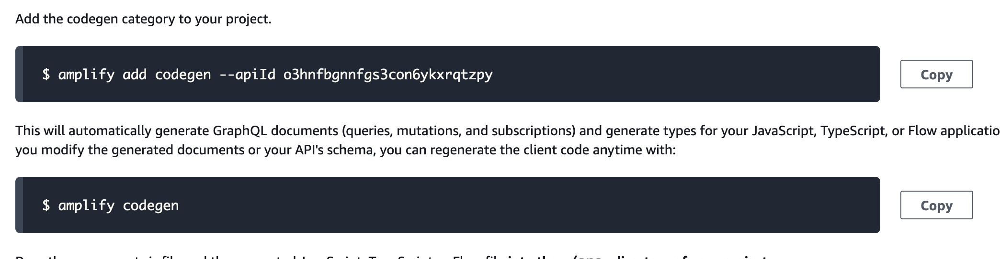
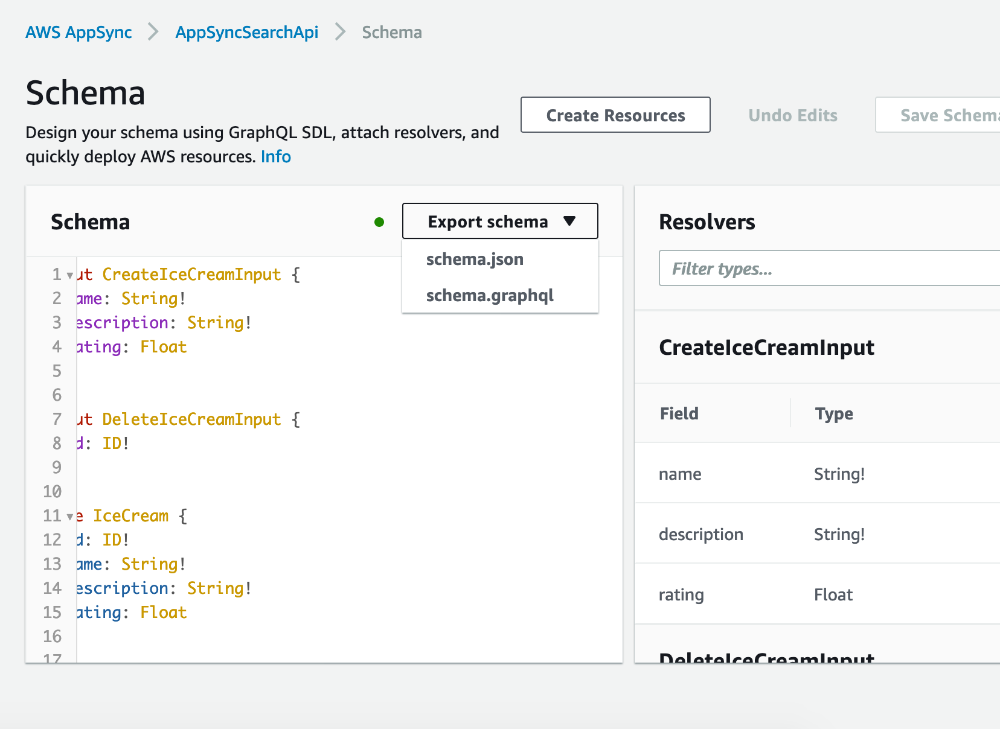
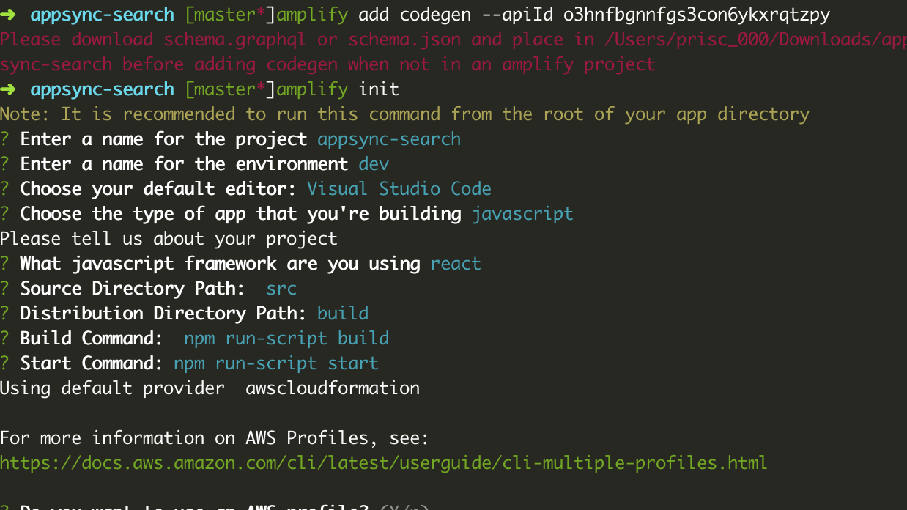
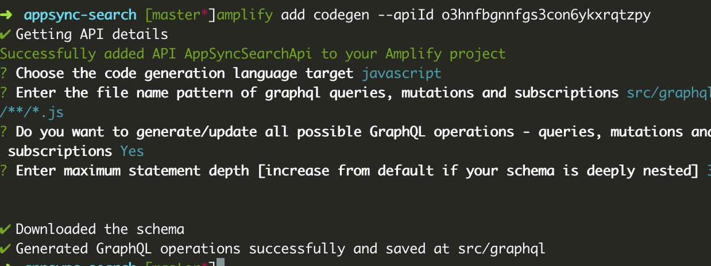
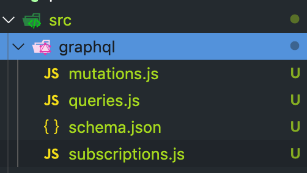

# Implementing Search in GraphQL, AWS, ReasonReact, Hooks & [NaderDabit] Part 1

> Original JS version of this tutorial can be found [here](https://github.com/dabit3/graphql-search).
In this tutorial, we’ll learn how to implement GraphQL search in a React Application using AWS AppSync & React Apollo.


To accomplish this we’ll have a search field that triggers a search when the user types into the input field and updates the UI as results come back from our GraphQL API.

We’ll begin by creating a new GraphQL API using AWS AppSync. We’ll then demonstrate how to use the built-in query editor to add items to the data source & query for them from within the AWS AppSync console.

Next, we’ll connect the API to our React app & implement a basic search field that will search the description field of our data source.

Finally, we’ll update the API to add a new searchField row in our table that will allow us to query all of the fields from a single query by combining the other fields into this comprehensive searchField. We’ll update the search functionality to be case-insensitive.
> There are multiple ways to implement search using AWS AppSync. The method we’ll use in this tutorial is DynamoDB filters that are autogenerated for us when creating an AppSync API. For more advanced use cases you can also take advantage of Amazon Elasticsearch as an AWS AppSync data source. I’ll be publishing a follow up to this, **part 2**, showing how to implement more sophisticated search operations such as fuzzy text, time & geospatial queries sometime in the near future.

## Getting Started

The first thing we will need to do is create a new AppSync API. To do so, go to the [AWS AppSync dashboard](https://console.aws.amazon.com/appsync/) & click **Create API**.

Choose **Author From Scratch** & give the API a name & click **Create:**

*Creating the API*

Next, click on **Schema** in the left menu & then click the **Create Resources **button in the top right corner:

*Create resources button*

Now we will define a new type in the **Define or select a type** section of the dashboard called **IceCream **with the following properties:

    type IceCream {
     id: ID!
     name: String!
     description: String!
     rating: Float
    }

Then, scroll to the bottom & click **Create:**

*Creating type & resources*

Now that this type has been created along with its resources, we can begin to perform operations against the API. First, let’s create a mutation by adding a few different types of ice cream. To do this, click on **Queries** in the left hand menu & execute a few mutations:

    mutation create {
      createIceCream(input: {
        name: "Peanut Butter World"
        description: "Milk chocolate ice cream with peanut buttery swirls & chocolate cookie swirls"
      }) {
        name
      }
    }

Execute this mutation a few times with different data to populate our API with a couple of types of ice cream.


Now, our database has information in it & we can begin querying for the data we would like!

First, let’s try it out by querying for a list of all ice creams in our database. To do so, in the same Queries editor execute the following query:

    query listAll {
      listIceCreams {
        items {
          name
          description
        }
      }
    }

This should give you a list of all of the ice creams in your database. Next, let’s try filtering by description for only ice cream with chocolate in it. This will be how we implement search on the client with a dynamic value, but for now let’s just use a hard coded value:

    query listAll {
      listIceCreams(filter: {
        description: {
          contains: "chocolate"
        }
      }) {
        items {
          name
          description
        }
      }
    }

### How filtering works

If you look at the Schema, and view the **listIceCreams** query, you will see that there are three optional arguments: filter, limit, & nextToken.


filter is a type of TableIceCreamFilterInput which allows us to filter based on any value in the field.

Let’s take a look at the TableStringFilterInput input:


The description is an input type of TableStringFilterInput:


Here, in the TableStringFilterInput, we can see all of the ways in which we can filter. The filter we’re using is the **contains** filter. We’re basically saying that if the field contains our search term, return the result. You can also see that we have the options of equals (eq), not equals (ne), notContains, & many others.

## Connecting the React Client Application

Now, let’s hook this up to a React application.

First, we need to create a new React app & install a few dependencies :

    mkdir reason-appsync-search
    cd reason-appsync-search
    npx create-react-app appsync-search --scripts-version cra-reason-template

Next, cd into the new directory & install the following dependencies:

    yarn add graphql-tag lodash.debounce aws-appsync-auth-link aws-appsync-subscription-link reason-apollo-hooks @apollo/react-hooks
Next, install the following devDependencies:

    yarn add -D @baransu/graphql_ppx_re html-webpack-plugin webpack webpack-cli webpack-dev-server

Because we like to live dangerously we are going to use the `prerelease` `bs-platform@6.2.1`. This version seems to work better with `@baransu/graphql_ppx_re` which we install next.

    yarn add bs-platform@6.2.1

We’ll be using the AppSync & Apollo packages to interact with our API, & the lodash package for debouncing our search input later. The authLink and subscriptionLink packages are will help us connect with Apollo with reason-apollo which we will install from git because the latest version works with bs-platform@6.2.1 but it has not been released at the time of this writing. We also need the [`@baransu/graphql_ppx_re`](https://github.com/baransu/graphql_ppx_re/blob/master/package.json) ppx. Run:

    yarn add https://github.com/apollographql/reason-apollo.git
    yarn add -D @baransu/graphql_ppx_re

Then add them to your `bsconfig.json` file like so:

      "bs-dependencies": [
        "reason-react",
        "reason-apollo",
        "reason-apollo-hooks"
      ],
      "ppx-flags": ["@baransu/graphql_ppx_re/ppx6"],

Copy the `webpack.config.js` file from [here](./images/webpack.config.js) and use it. I'm not great with the webpack thing. I copied this one from [here](https://github.com/MargaretKrutikova/reason-apollo-dashboard/blob/master/webpack.config.js). Thanks [@rita_krutikova](https://twitter.com/rita_krutikova)!

Next, let’s download the `aws-exports.js` file from the AppSync dashboard & save it in the `src` directory of our new project:


Next, we’ll update index.js:

<iframe src="https://medium.com/media/31fbeb9e6c7e60659e615c952909e8bb" frameborder=0></iframe>

All that we’ve done here is we’ve created a new AppSync client using a combination of our AppSync.js configuration along with AWS AppSync & React Apollo.

## Implementing Search Functionality on the Client

To get our graphql working with our ppx we are going to need to get the introspection schema that the ppx is working against. We can get it a few different ways and here is one. Back in the [AWS AppSync dashboard] in the setting section you will see:



Click the `copy` button next to `amplify add codegen`. Then go to your terminal and run it. If you don't have the `amplify-cli` set up, I recommend you do so. Otherwise you can download the schema from the `schema` panel in the console.



Select the `schema.json` version. Then run `cp path/to/schema.json graphql_schema.json`.



Whoops! That didn't work. I am updating an older tutorial here and some things have changed. I guess you have to get the Amplify Cli now. Go [here](https://aws-amplify.github.io/) and do it then come back.

All set? Great. Let's try that again.



If that worked you should have a `src/graphql` directory with a `schema.json` file.



Now let's run:

    cp src/graphql/schema.json graphql_schema.json

To implement search via the client, we’ll be using the [data.fetchMore](https://www.apollographql.com/docs/react/api/react-apollo.html#graphql-query-data-fetchMore) function from React Apollo. We’ll pass a function to our component, onSearch, that will pass in the search query. onSearch will call props.data.fetchMore passing in the query, variables, & updateQuery necessary to execute the operation.

The GraphlQL query will end up looking like this:

```reason

    module IceCreamsQueryConfig = [%graphql
      {|
      query ListIceCreams($searchQuery: String) {
        listIceCreams(filter: {
          description: {
            contains: $searchQuery
          }
        })
        {
          items{
            id
            name
            description
            rating
          }
        }
      }
    |}
    ];

    module IceCreamsQuery = ReasonApolloHooks.Query.Make(IceCreamsQueryConfig);

```

To trigger the query, we’ll use debounce from lodash to only trigger the function if the user does not type for a given period, in our case 250 milliseconds:

    onChange = (e) => {
      const value = e.target.value
      this.handleFilter(value)
    }
    handleFilter = debounce((val) => {
      this.props.onSearch(val)
    }, 250)

The final code, including styling, is here:

<iframe src="https://medium.com/media/ec1d676edaa441126741ac4dc73eefba" frameborder=0></iframe>

1. Import debounce from lodash

1. We create the search query, expecting an argument of searchQuery that will be our query.

1. We also have a regular query to fetch all items (if the search is an empty string) & also to initially load the app with all of the data.

1. We create an initial state, setting searchQuery to an empty string.

1. onChange will not call the search function itself, it will instead call the handleFilter function, passing in the value of the input as the argument.

1. handleFilter will call the onSearch function passed down to our component as props, passing in the value of the search. We use debounce to only execute the operation if the user has not typed in the past 250 milliseconds.

1. If the app is loading data from a search, we show a **Searching** message to the user.

1. If there are no search results, we display a message letting the user know there were no results.

1. We map over the items returned from the API, displaying both the name & description.

1. We check the searchQuery property. If it is an empty string, we perform a query to fetch all results (ListIceCreams), if searchQuery is not an empty string, we perform a search (SearchIceCreams).

1. In the updateQuery function, we update the cache with the new results from our search query (fetchMoreResult.listIceCreams.items), triggering a re-render of our component & showing them to the user.

Now, we should be able to run the app and perform searches on the description field of our table!

    npm start

## Improvements

What we have now is a great start, but ideally we’d like to be able to search across *all* fields in the table, not just the description.

We’d also like to make the search case-agnostic / case-insensitive. Let’s update our API & client application to do both of these things!

### Updating the AWS AppSync API

The next thing we’ll do to get this working is to update the API to be able to search across all fields instead of a single field.

The approach we will be taking is to take **all** of the fields that we want searchable & create a searchField field that is a concatenation of all of these fields. We’ll also transform the text to lowercase so we can perform case-insensitive searches.

To get this to work, we’ll need to update the resolver for creating a new item. This resolver is the createIceCream resolver. To update this resolver, open the schema view in the AWS AppSync console & then click on the resolver next to the field:


In this view, we’ll update the request mapping template to be the following:

<iframe src="https://medium.com/media/ab4019c1c1190c7095962ea2c533890c" frameborder=0></iframe>

What’s going on here?

First we create a new variable called vars that contains the values passed in from the mutation.
Next, we create two new variables (s1 & s2) that take the name & description values & store them as lowercase.
Finally we add a new key / value pair to our vars Map containing the new fields, and we call that value searchField.


Now, whenever a new item is created, we’ll also create a new searchField property that will contain a lowercase name & description field concatenated together. We will now use this as our search field.

Next, we need to update the TableIceCreamFilterInput input in our Schema to add the new searchField property:

    input TableIceCreamFilterInput {
     id: TableIDFilterInput
     name: TableStringFilterInput
     description: TableStringFilterInput
     rating: TableFloatFilterInput
     **searchField: TableStringFilterInput**
    }

Update the TableIceCreamFilterInput input to the above & click **Save Schema** to update the Schema.

Because our old properties did not have the searchField property, we can not query against them. Let’s delete what we have in our database & start over with our new setup.

To delete these items, click on **DataSources** in the left menu, click on the **IceCreamTable** data source, choose the **Items** tab in DynamoDB & delete all of the items:


Now, we should be able to go back to our Query editor & add new items that will now contain the new searchField property upon creation. Notice nothing changes on our part when creating, all of this is happening in our mapping template so all we need to do is pass in the same fields we passed in before:

    mutation create {
      createIceCream(input: {
        name: "Peanut Butter World"
        description: "Milk chocolate ice cream with peanut buttery swirls & chocolate cookie swirls"
      }) {
        name
      }
    }

Again, create a couple of different types of ice cream.

Now, click on DataSources again, open the DynamoDB table, & view the table. You should now see a new field, searchField, in your table:


Now, let’s try querying based on this new searchField field.

In the Queries editor, execute a query and see if we can get the results from our API using properties from either the name field or the description field:

    query listAll {
      listIceCreams(filter: {
        searchField: {
          contains: "s'mores"
        }
      }) {
        items {
          name
          description
        }
      }
    }
> Remember, to achieve case-insensitive search we are transforming the text to lowercase before storing it in our database, so uppercase searches here will not work. In the client, we’ll be transforming all queries to lowercase before passing them to our API to achieve case-insensitive search, but in the query editor we are hard-coding our search queries.

## Updating the Client

Finally, we want to update the client to perform these comprehensive case-insensitive searches. Luckily, this is really easy, we only need a couple of changes.

First, we need to update our SearchIceCreams query definition to use the searchField as opposed to the description field as the filtered field:

    const SearchIceCreams = gql`
      query($searchQuery: String) {
        listIceCreams(filter: {
          **searchField**: {
            contains: $searchQuery
          }
        }) {
          items {
            name
            description
          }
        }
      }
    `

Next, we will transform any query to lowercase before sending it to our API. In the onSearch function, we’ll add a new line of code to achieve this before calling props.data.fetchMore:

    // above code omitted
    props: props => ({
      onSearch: searchQuery => {
        **searchQuery = searchQuery.toLowerCase() // added**
        return props.data.fetchMore({
        // below code omitted

Now, we should be able to execute searches on both the name & description fields and get results!

The final codebase is located [here](https://github.com/dabit3/graphql-search).
> My Name is [Nader Dabit](https://twitter.com/dabit3). I am a Developer Advocate at [AWS Mobile](https://aws.amazon.com/mobile/) working with projects like [AWS AppSync](https://aws.amazon.com/appsync/) and [AWS](https://github.com/aws/aws-amplify)[Amplify](https://github.com/aws/aws-amplify), and the founder of [React Native Training](http://reactnative.training/).
> If you enjoyed this article, **please clap n number of times** and share it! Thanks for your time.

[NaderDabit]: https://twitter.com/dabit3
[AWS AppSync dashboard]:https://console.aws.amazon.com/appsync/
